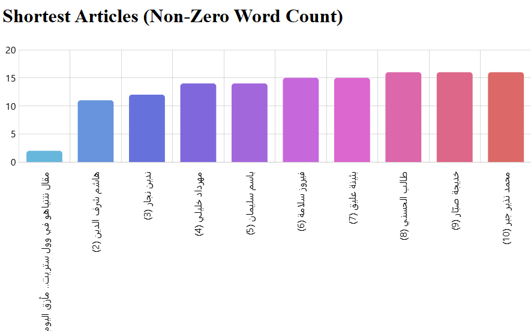

# AlMayadeen Article Analyzer

This project is a comprehensive solution to scrape, analyze, store, and visualize articles from Al Mayadeen's website. The project covers multiple aspects such as web scraping, data storage in MongoDB, data analysis with NLP techniques, user authentication, and data visualization through amCharts in a Flask-based API.

## Project Workflow:

### 1. Web Scraping Al Mayadeen Articles

**Objective**: Scrape articles from Al Mayadeen's sitemap, extract metadata, and save the data in JSON format for further analysis.

- **Script**: `web_scraper.py` scrapes articles from Al Mayadeen's sitemap and saves them as JSON files organized by month.
- **Script**: `nb_of_articles.py` is a utility to count and display the number of articles stored in each JSON file.

**Procedure**:
- Extract metadata such as the article title, author, publish date, and content from the sitemap.
- Store the scraped articles as JSON files, categorized by month.

---

### 2. Data Storage and Flask API Development

**Objective**: Store the scraped articles in MongoDB and create a Flask API to query and analyze the data.

- **Script**: `data_storage.py` loads the JSON files and inserts the articles into a MongoDB database.
- **API**: `app.py` is a Flask API that provides various endpoints to query and analyze the data stored in MongoDB.

**Procedure**:
- Store article metadata and content in MongoDB for efficient querying.
- Develop Flask API routes to serve data for querying, analysis, and visualization.

Key API Endpoints:
- `/dashboard`: Main dashboard for viewing all data visualizations.
- `/authors_dashboard`: View top authors based on article count.
- `/keywords_dashboard`: View top keywords across articles.
- `/date_time_dashboard`: Analyze data based on date and time.
- `/word_count_dashboard`: Group articles by word count.
- `/sentiment_analysis_dashboard`: Display sentiment analysis charts.
  
---

### 3. User Authentication (Register, Login, and Logout)

**Objective**: Implement user authentication, allowing users to register, log in, and log out.

- **Pages**: 
  - `register.html`: The registration page allows users to create an account by providing a first name, last name, email, and password.
  - `login.html`: The login page allows existing users to log in using their email and password.
  - `logout`: Allows users to log out and clear their session.

- **Procedure**:
  - **Registration**: Users register by providing their details. Passwords are securely hashed using `pbkdf2:sha256` before storing them in MongoDB.
  - **Login**: Users log in with their email and password. The system verifies the email and compares the provided password with the stored hash.
  - **Logout**: Users can log out, which clears their session data.

**Key Scripts**:
- `app.py`: 
  - `/register`: Handles new user registration.
  - `/login`: Handles user authentication and session management.
  - `/logout`: Clears user session and logs them out.

**Registration and Login Pages**:

- **Registration Page**: Allows new users to create an account by providing a valid email, password, and other details.
  
  

- **Login Page**: Existing users can log in by providing their email and password.

  

---

### 4. Data Visualization with amCharts

**Objective**: Visualize data from the articles using amCharts to display insights like keyword frequency, top authors, and publication trends.

- **Template**: `templates/` contains the HTML templates for rendering charts.
- **Static Files**: `static/` contains the JavaScript and CSS files for rendering amCharts.
- **API**: Flask API endpoints serve data for charts such as top authors, keyword frequency, and sentiment analysis.

**Procedure**:
- Visualize insights such as top keywords, article word count, sentiment distribution, and more using interactive charts.
- Charts are generated using data retrieved from MongoDB through Flask API endpoints.

**Sample Charts**:
- **Top Authors Chart**:
  

- **Keyword Frequency Word Cloud**:
  

- **Articles by Word Count**:
  

- **Articles by Date**:
  

- **Longest Articles**:
  

- **Shortest Articles**:
  

- **Entities Table**:
  

- **Articles With Video**:
  

---

### 5. Sentiment Analysis and Entity Recognition

**Objective**: Perform advanced data analysis on the scraped articles, such as sentiment analysis and entity recognition.

- **Script**: `sentiment_analysis.py` uses NLP techniques to determine if the sentiment of each article is positive, neutral, or negative.
- **Script**: `entity_recognition.py` extracts named entities (such as people, places, and organizations) from the article content.

**Procedure**:
- **Sentiment Analysis**: Analyze the tone of each article using NLP to categorize articles as positive, neutral, or negative.
- **Entity Recognition**: Extract key entities like people, organizations, and places from the article text for further analysis.

---

### 6. Code Refactoring and Optimization

**Objective**: Refactor the codebase to adhere to best practices, optimize MongoDB queries for better performance, and introduce unit tests.

**Procedure**:
- Refactor scripts following SOLID principles.
- Optimize MongoDB queries for better performance during data retrieval and analysis.
- Introduce unit tests to ensure reliability and maintainability of the codebase.

---

## Setup

Follow these steps to set up your development environment:

### Prerequisites

- Python 3.6+ installed on your system. [Download Python](https://www.python.org/downloads/)
- MongoDB installed and running locally. [Download MongoDB](https://www.mongodb.com/try/download/community)

### Installation

1. **Clone the Repository**:
   ```bash
   git clone https://github.com/Malak-Srour/Web_Scraper.git
   cd Web_Scraper

2. **Install Required Python Libraries**:
   ```bash
    pip install -r Requirements.txt

### Usage:

1. **Scraping Articles**:

    Run the script to scrape articles:
   ```bash
    python web_scraper.py

2. **Storing Articles in MongoDB**:

    Load the scraped articles into MongoDB:
   ```bash
    python data_storage.py

3. **Running the Flask API**:

    Start the Flask API to serve the data and visualizations:
   ```bash
    python app.py

4. **Performing Sentiment Analysis**:

    Analyze the sentiment of the articles:
   ```bash
    python sentiment_analysis.py
   
5. **Extracting Entities**:

    Extract entities from the article content:
   ```bash
    python entity_recognition.py
   

6. **Visualizing Data**:

    Navigate to the dashboard to see the charts and visualizations once the Flask API is running.

---

## API Endpoints

The Flask API provides several endpoints for querying the data and visualizing it through interactive charts.

### Authentication Endpoints:
- `/register`: Allows users to create an account.
- `/login`: Allows users to log in with their credentials.
- `/logout`: Logs the user out and clears their session.

### Dashboard Endpoints:
- `/dashboard`: Main dashboard for visualizing data.
- `/authors_dashboard`: Displays top authors.
- `/keywords_dashboard`: Displays top keywords.
- `/date_time_dashboard`: Displays charts by date and time.
- `/word_count_dashboard`: Displays articles grouped by word count.
- `/sentiment_analysis_dashboard`: Displays sentiment analysis charts.

---

## Tools and Libraries Used

- **Python**: The primary programming language.
- **Flask**: A web framework for building the API and serving visualizations.
- **MongoDB**: The database for storing scraped articles.
- **TextBlob**: Used for performing sentiment analysis.
- **Stanza**: Used for entity recognition to extract people, places, and organizations from the articles.
- **amCharts**: A JavaScript library for creating interactive data visualizations.
- **BeautifulSoup & Requests**: Libraries used for web scraping.

